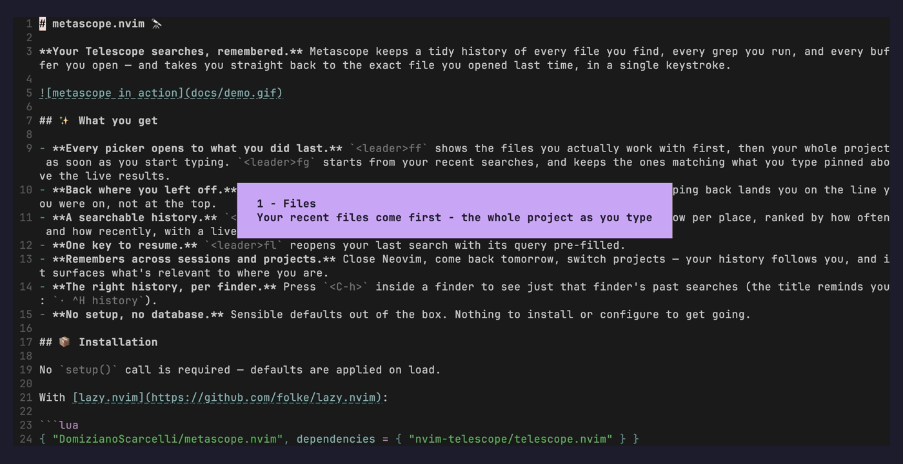
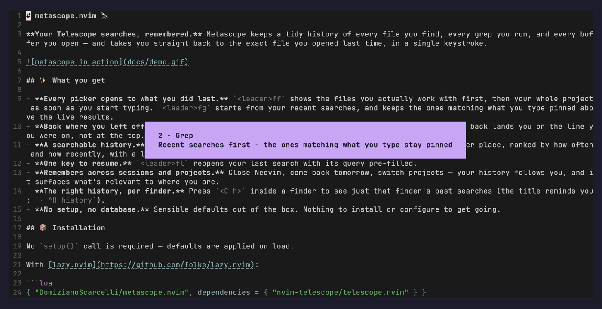
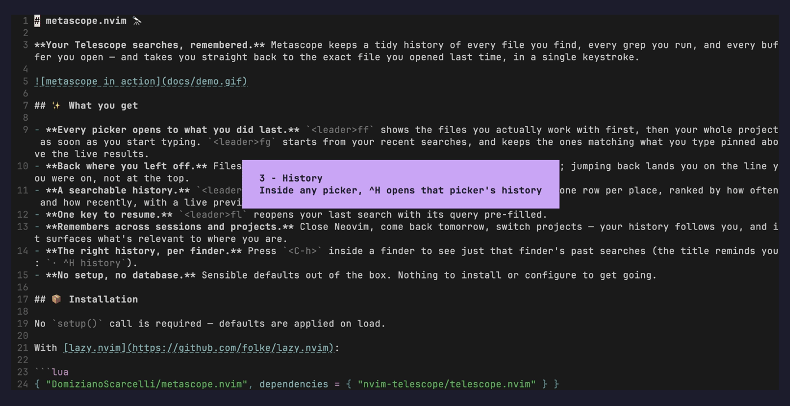

# metascope.nvim 🔭

**Telescope, with a memory.** Every file you open, every grep you run, every buffer you switch to — metascope remembers it, ranks it by how often and how recently, and puts it one keystroke away. Open a picker and the thing you're looking for is usually already at the top.



## Three ideas

**1. Pickers open to what you did last.** Empty prompt = your recent files (or recent searches), ranked by frecency. Start typing and the whole project fades in, with the files you actually work on still floating to the top.

**2. Searches take you back to where they led.** Metascope records the file — and the line — each search opened. Pick a past search and you land there directly; no results list to dig through again. Files remember your cursor, so "back to `hybrid.lua`" means line 167, not line 1.

**3. History is everywhere, not in a separate tool.** `<C-h>` inside any picker shows that picker's history. `<leader>fh` is the full dashboard. `<leader>fl` reopens your last search.

## See it

### Grep — recent searches first, pinned as you type

Your last queries show up before you type. Start typing and the ones that match stay pinned above the live `rg` results, so re-running yesterday's search is a few letters and `<CR>`.



### History — `^H` in any picker, or the dashboard

One row per place you've been, with the query that got you there, when, and how often. `Tab` cycles the type filter (all → buffers → files → grep). `<CR>` jumps back; `<C-r>` re-runs the search instead.



## Install

No `setup()` required — defaults apply on load.

```lua
-- lazy.nvim
{ "DomizianoScarcelli/metascope.nvim", dependencies = { "nvim-telescope/telescope.nvim" } }
```

```lua
-- packer.nvim
use { "DomizianoScarcelli/metascope.nvim", requires = { "nvim-telescope/telescope.nvim" } }
```

Optional: [nvim-web-devicons](https://github.com/nvim-tree/nvim-web-devicons) for filetype icons, `fd`/`rg` for fast file listing and grep (same as Telescope).

## Keys

Let metascope bind the recommended set with `keymaps = true`, or bind the functions yourself.

| Key | Function | What it does |
| --- | --- | --- |
| `<leader>ff` | `metascope.find_files()` | Files — recents first, whole project as you type |
| `<leader>fg` | `metascope.live_grep()` | Grep — recent searches first, matching ones pinned while typing |
| `<leader>fb` | `metascope.buffers()` | Buffers — standard Telescope, with history recorded |
| `<leader>fh` | `metascope.history_picker()` | The history dashboard |
| `<leader>fl` | `metascope.resume_last()` | Reopen the last search with its query |

Inside a picker:

| Key | Action |
| --- | --- |
| `<CR>` | Open — for a remembered search, jump straight back to where it took you |
| `<C-h>` | History for *this* picker only |
| `<C-r>` | Re-run the search instead of jumping (dashboard) |
| `<Tab>` | Cycle the type filter (dashboard) |
| `<C-d>` / `dd` | Forget this entry (dashboard) |

Want the plain Telescope picker, still recorded? `metascope.find_files({ hybrid = false })`. `metascope.hybrid()` / `hybrid_grep()` remain as aliases of `find_files()` / `live_grep()`.

```lua
local metascope = require("metascope")
vim.keymap.set("n", "<leader>ff", metascope.find_files, { desc = "Files" })
vim.keymap.set("n", "<leader>fg", metascope.live_grep, { desc = "Grep" })
vim.keymap.set("n", "<leader>fh", metascope.history_picker, { desc = "History" })
vim.keymap.set("n", "<leader>fl", metascope.resume_last, { desc = "Resume last search" })
```

## Configuration

Everything is optional. These are the defaults:

```lua
require("metascope").setup({
    max_history = 10000,
    picker_history_keymap = "<C-h>",  -- open per-picker history; false to disable
    picker_history_keymap_mode = { "i", "n" },
    title_hint = true,                -- show "· ^H history" in picker titles
    resume_keymap = "<C-r>",          -- dashboard: re-run the search instead of jumping
    cwd_boost = 4,                    -- favour entries from the project you're in
    half_life_days = 3,               -- how fast older entries fade in ranking

    hybrid = {
        source_types = { "files", "buffers" }, -- history types that count as "recent files"
        show_all_on_empty = false,    -- empty prompt: recents only (false) or whole tree (true)
        cwd_only = true,              -- only show recents from the current project
        find_command = nil,           -- override the file-listing command, e.g. { "fd", "--type", "f" }
        max_pinned = 5,               -- grep: recent queries kept above live results while typing
    },

    -- true binds ff / fg / fb / fh / fl as above; a table
    -- { find_files = ..., live_grep = ..., buffers = ..., history = ..., last = ... }
    -- customises (any may be false); omit to bind them yourself.
    keymaps = false,
})
```

History lives in `stdpath("data")/telescope_metascope_history.json` — one file, shared across projects, merged safely between concurrent Neovim instances.

### Custom pickers

Teach metascope about any other picker (LSP symbols, git files, …) so it records and resumes them too:

```lua
local metascope = require("metascope")
metascope.register_type("symbols", {
    label = "Sym", icon = " ",
    resume = function(opts) require("telescope.builtin").lsp_document_symbols(opts) end,
})
vim.keymap.set("n", "<leader>fs", function()
    require("telescope.builtin").lsp_document_symbols(metascope.track("symbols", {}))
end)
```

### Commands

`:Metascope` opens the dashboard; `:Metascope files` (or `grep`, `buffers`) filters by type. Also available as a Telescope extension: `:Telescope metascope history`.

## AI transparency

This plugin is **100% AI-written** (Claude, via Claude Code), built to scratch the maintainer's own itch and verified by using it — not by line-by-line review. Bugs, rough edges and surprising behaviour are expected; if you hit one, open an issue with a repro. The full note is in [AI_TRANSPARENCY.md](AI_TRANSPARENCY.md).

## Inspiration

[Atuin](https://github.com/atuinsh/atuin) gave shell history search and sync; metascope brings that "never lose what you searched for" feeling to Telescope.

---

<details>
<summary>Recording the demo clips</summary>

The clips are recorded with [vhs](https://github.com/charmbracelet/vhs) from the repo root — `vhs docs/files.tape`, `docs/grep.tape`, `docs/history.tape` — against a throwaway, seeded history (`docs/demo_init.lua`). They need a Nerd Font installed (`JetBrainsMono Nerd Font`) and Telescope available under your plugin manager's data dir. vhs v0.12.0 renders nothing on macOS (context cancelled before ffmpeg runs); use v0.11.0 (`go install github.com/charmbracelet/vhs@v0.11.0`) until that's fixed.

</details>
