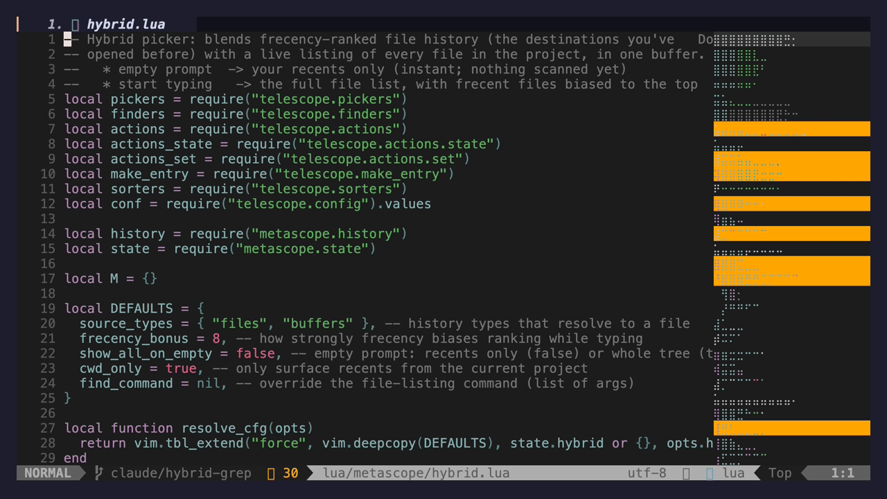

# metascope.nvim 🔭

**Your Telescope searches, remembered.** Metascope keeps a tidy history of every file you find, every grep you run, and every buffer you open — and takes you straight back to the exact file you opened last time, in a single keystroke.



## ✨ What you get

- **Opens to your recent files.** `<leader>fo` shows the files you actually work with first, then your whole project as soon as you start typing.
- **Smarter grep.** `<leader>fg` starts from your recent searches, then becomes a live grep the moment you type.
- **A searchable history.** `<leader>fh` opens a dashboard of everything you've searched — with a live preview. Pick one and jump right back to the file you opened from it.
- **Remembers across sessions and projects.** Close Neovim, come back tomorrow, switch projects — your history follows you, and it surfaces what's relevant to where you are.
- **The right history, per finder.** Press `J` inside a finder to see just that finder's past searches.
- **No setup, no database.** Sensible defaults out of the box. Nothing to install or configure to get going.

## 📦 Installation

No `setup()` call is required — defaults are applied on load.

With [lazy.nvim](https://github.com/folke/lazy.nvim):

```lua
{ "DomizianoScarcelli/metascope.nvim", dependencies = { "nvim-telescope/telescope.nvim" } }
```

With [packer.nvim](https://github.com/wbthomason/packer.nvim):

```lua
use { "DomizianoScarcelli/metascope.nvim", requires = { "nvim-telescope/telescope.nvim" } }
```

## 🚀 Ways to search

Metascope gives you a few different entry points. The fastest way to set them up is `keymaps = true` (see Configuration); or bind whichever you like yourself.

| Function | What it does | Suggested key |
| --- | --- | --- |
| `metascope.hybrid()` | **Files** — your recent files first, the whole project as you type. | `<leader>fo` |
| `metascope.hybrid_grep()` | **Grep** — your recent searches first, live grep as you type. | `<leader>fg` |
| `metascope.history_picker()` | **History dashboard** — search everything you've ever looked for. | `<leader>fh` |
| `metascope.find_files()` / `live_grep()` / `buffers()` | **Standard Telescope**, just with history quietly recorded. | `<leader>ff` / `fb` |

```lua
local metascope = require("metascope")

vim.keymap.set("n", "<leader>fo", function() metascope.hybrid() end, { desc = "Files" })
vim.keymap.set("n", "<leader>fg", function() metascope.hybrid_grep() end, { desc = "Grep" })
vim.keymap.set("n", "<leader>fh", function() metascope.history_picker() end, { desc = "History" })
vim.keymap.set("n", "<leader>ff", function() metascope.find_files({ hidden = true }) end, { desc = "Find files" })
vim.keymap.set("n", "<leader>fb", function() metascope.buffers() end, { desc = "Buffers" })
```

Inside a picker:

| Key | Action |
| --- | --- |
| `<CR>` | Open the file — for a remembered search, jump straight to the line you opened last time |
| `<C-r>` | Re-run the search instead of jumping |
| `<C-d>` / `dd` | Delete a history entry (in the dashboard) |
| `J` | Open the history for *this* finder only |

## ⚙️ Configuration

Everything is optional. These are the defaults:

```lua
require("metascope").setup({
    max_history = 10000,
    picker_history_keymap = "J",      -- open per-picker history; false to disable
    picker_history_keymap_mode = "n",
    resume_keymap = "<C-r>",          -- in the dashboard: re-run the search instead of jumping
    cwd_boost = 4,                    -- favour results from the project you're in
    half_life_days = 3,               -- how fast older entries fade in ranking

    hybrid = {
        source_types = { "files", "buffers" },
        show_all_on_empty = false,    -- empty prompt: recents only (false) or whole tree (true)
        cwd_only = true,              -- only show recents from the current project
        find_command = nil,           -- override the file-listing command, e.g. { "fd", "--type", "f" }
    },

    -- Bind the keymaps for you. `true` binds ff / fg / fh / fo as above;
    -- pass a table to customise, or omit to bind them yourself.
    keymaps = true,
})
```

### Custom pickers

Teach metascope about any other picker (LSP symbols, git files, …) so it records and resumes them too:

```lua
local metascope = require("metascope")
metascope.register_type("symbols", {
    label = "Sym", icon = " ",
    resume = function(opts) require("telescope.builtin").lsp_document_symbols(opts) end,
})
vim.keymap.set("n", "<leader>fs", function()
    require("telescope.builtin").lsp_document_symbols(metascope.track("symbols", {}))
end)
```

### Commands

`:Metascope` opens all history; `:Metascope files` filters by type. Also available as a Telescope extension: `:Telescope metascope history`.

## 💡 Inspiration

Metascope is inspired by [Atuin](https://github.com/atuinsh/atuin), which gives your shell history magical search and sync. Metascope brings that same "never lose what you searched for" feeling to Telescope.
